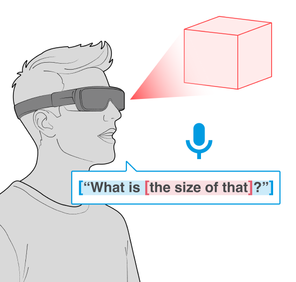
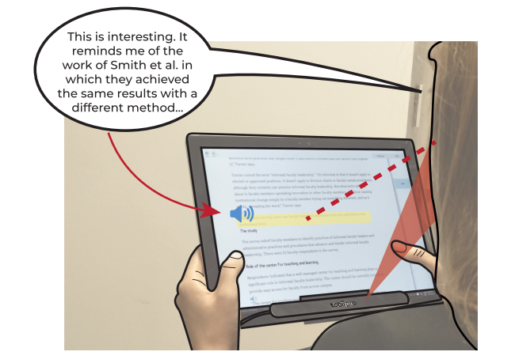
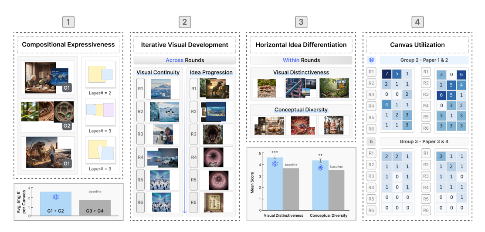
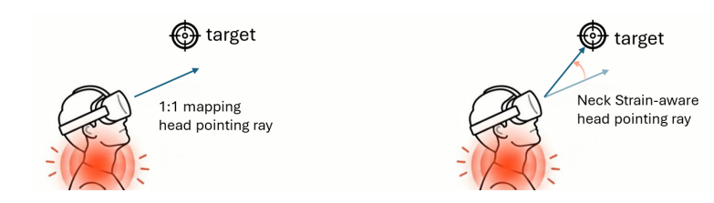
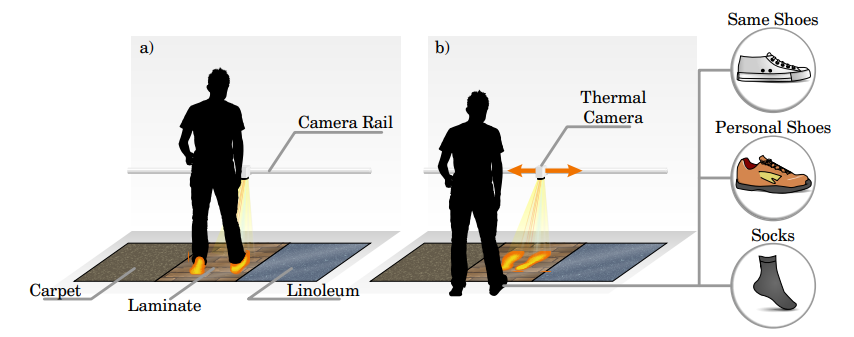

<strong>My research sits at the intersection of Human-Computer Interaction, Machine Learning, and Sensing</strong>, guided by two core questions: <em>how can user interfaces be augmented with intelligence to support interaction?</em> and <em>what insights about human behavior can be derived from interaction and sensor data?</em>
To address these questions, my work spans <strong>multimodal and implicit interaction</strong>, <strong>intelligent and adaptive interfaces</strong>, <strong>reading and note-taking in digital environments</strong>, <strong>physiological user modeling</strong>, and <strong>creativity support tools</strong> — with the goal of designing systems that are both technically robust and human-centered.

<h2>How can user interfaces be augmented with intelligence to support interaction?</h2>

<h3>Gaze &amp; Multimodal Interaction</h3>

  
  

    <em>Eye tracking · Gaze input · Voice interaction · Head movement · Multimodal HCI</em>
  

I investigate how multiple input modalities—such as gaze and speech—can be combined to enable more natural and expressive interaction. My work focuses on <strong>implicit and multimodal interaction</strong>, where systems infer user intent from natural behavior rather than relying solely on explicit input.

<strong>Key publications</strong>

<ul>
  <li><a href="https://doi.org/10.1145/3772318.3791662">Gaze and speech in multimodal HCI: A scoping review</a> — <em>CHI 2026</em></li>
  <li><a href="https://doi.org/10.1145/3491102.3502134">Integrating gaze and speech for enabling implicit interactions</a> — <em>CHI 2022</em></li>
  <li><a href="https://doi.org/10.1145/3453988">GAVIN: Gaze-assisted voice-based implicit note-taking</a> — <em>TOCHI 2021</em></li>
</ul>

<h3>Reading, Note-Taking &amp; Digital Learning</h3>

  
  

    <em>Digital reading · Note-taking · Learning technologies · Comprehension</em>
  

This work investigates how <strong>input modality</strong>, <strong>task difficulty</strong>, and <strong>interaction design</strong> shape learning and knowledge retention in digital environments, with the goal of designing tools that actively support learning rather than simply digitize existing workflows.

<strong>Key publications</strong>

<ul>
  <li><a href="https://doi.org/10.1145/3491102.3501974">To type or to speak? Input modality and comprehension</a> — <em>CHI 2022</em></li>
  <li><a href="https://doi.org/10.1007/s11423-021-10084-1">Modeling task difficulty in learning environments</a> — <em>IJAIED 2022</em></li>
  <li><a href="https://doi.org/10.1145/3453988">GAVIN: Gaze-assisted voice-based implicit note-taking</a> — <em>TOCHI 2021</em></li>
</ul>

<h3>Creativity Support Tools</h3>

  
  

    <em>XR · Creativity support · Intelligent tools · Human–AI collaboration</em>
  

This work explores how intelligent systems can support <strong>creativity and expressive work</strong>, particularly in immersive environments. It focuses on designing tools that augment ideation, collaboration, and creative workflows using AI and XR technologies, extending my prior work in interaction and user modeling toward systems that enhance human expression.

<strong>Selected work</strong>

<ul>
  <li>Atomix: augmenting brainsketching through generative visual outputs — <em>C&amp;C 2026 (In-press)</em></li>
  <li><a href="https://make.kaist.ac.kr/files/2026/KimH_XRconcert_KHCI26.pdf"> Understanding XR-Supported Creative Collaboration through a Domain-Specific Lens</a> — <em>HCI Korea 2026</em></li>
  <li><a href="https://make.kaist.ac.kr/files/2026/LeeG_Bias_KHCI26.pdf">Passthrough Interpretive Assistant: Revealing Hidden Intent and
Bias in eXtended Reality with AI</a> — <em>HCI Korea 2026</em></li>
</ul>

<h2>What insights about human behavior can be derived from interaction and sensor data?</h2>

<h3>Eye–Head Dynamics in XR</h3>

  
  

    <em>Virtual reality · Eye–head coordination · Hands-free interaction · Attention modeling</em>
  

This research investigates how eye and head movement  <strong>coordinate dynamically</strong> and how this coordination can be leveraged to design efficient, hands-free interaction techniques. This work introduces methods for distinguishing gaze and head intent, modeling attention shifts, and enabling <strong>adaptive interaction techniques</strong> that respond to user behavior in real time.

<strong>Key publications</strong>

<ul>
  <li><a href="https://doi.org/10.1145/3806016"> Directed or Guided? Classification of Gaze Attention Shifts
based on Eye and Head Movement</a> — <em>ETRA 2026</em></li>
 
  <li><a href="https://doi.org/10.1145/3655601">GazeSwitch: Automatic Eye-Head Mode Switching for
Optimised Hands-Free Pointing</a> — <em>ETRA 2024</em></li>
   <li><a href="https://doi.org/10.1145/3544548.3581201">Classifying head movements to separate head-gaze and head gestures as distinct modes of input</a> — <em>CHI 2022</em></li>
</ul>

<h3>Physiological &amp; Sensor-Based User Modeling</h3>

  
  

    <em>Thermal imaging · EDA · Attention · Cognitive modeling</em>
  

This work explores how physiological and behavioral signals can be used to infer users’ identity, cognitive, and affective states. It leverages modalities such as eye tracking, electrodermal activity (EDA), and thermal imaging to detect <strong>attention, cognitive load, and mind wandering</strong>. The goal is to enable <strong>adaptive, context-aware systems</strong> that respond intelligently to users’ internal states and support more effective interaction.

<strong>Key publications</strong>

<ul>

  <li><a href="https://doi.org/10.1145/3544548.3580924">HotFoot: Foot-Based User Identification Using Thermal Imaging
 — <em>CHI 2022</em></li>
     <li><a href="https://doi.org/10.3390/s20092546"> Mind Wandering in a Multimodal Reading Setting: Behavior Analysis & Automatic Detection Using Eye-Tracking and an EDA Sensor</a> — <em>Sensors 2022</em></li>
   <li><a href="https://doi.org/10.1145/3351227">Classifying Attention Types with Thermal Imaging and Eye Tracking</a> — <em>IMWUT 2019</em></li>

<h2>Full Publications</h2>

For a complete list of publications, see my 
<a href="https://scholar.google.com/citations?user=j5thF_4AAAAJ&hl=en">Google Scholar</a>.

